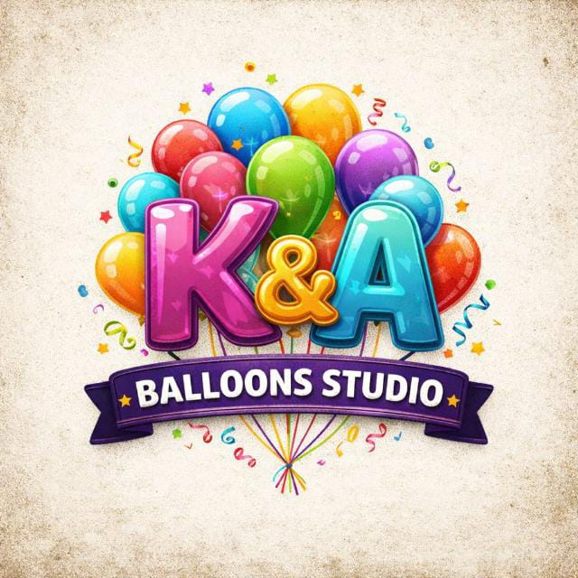

<div align="center">



# K&A Balloons Studio

**Sitio web oficial · Official Website**

[](#-licencia--copyright)
[](#)
[](#)
[](#)

> Empresa de diseño y decoración con globos en Bogotá D.C. y municipios de la Sabana.<br/>
> Balloon design and decoration studio based in Bogotá, Colombia.

---

⚠️ **PROPRIETARY — ALL RIGHTS RESERVED**<br/>
Copying, cloning, or reusing any part of this repository without written authorization is strictly prohibited and constitutes copyright infringement.

</div>

---

## 📋 Tabla de Contenidos

- [Sobre el Proyecto](#-sobre-el-proyecto)
- [Páginas & Funcionalidades](#-páginas--funcionalidades)
- [Tecnologías Utilizadas](#-tecnologías-utilizadas)
- [Estructura del Proyecto](#-estructura-del-proyecto)
- [Variables de Entorno & Configuración](#-variables-de-entorno--configuración)
- [Contacto](#-contacto)
- [Licencia & Copyright](#-licencia--copyright)

---

## 🎈 Sobre el Proyecto

**K&A Balloons Studio** es el sitio web corporativo oficial de la empresa homónima, dedicada a la creación de decoraciones artísticas con globos para eventos sociales y corporativos en Bogotá D.C. y municipios cercanos.

El sitio fue diseñado y desarrollado a medida para ofrecer:

- Presentación profesional de servicios y portafolio de proyectos reales
- Sistema de reservas en línea con validación de ubicación (solo Bogotá y Sabana)
- Notificación de confirmación al cliente tras enviar una solicitud
- Panel de administración privado para gestión de reservas e inventario
- Soporte bilingüe español / inglés con cambio de idioma en tiempo real
- Diseño completamente responsivo (mobile-first)

---

## 🌐 Páginas & Funcionalidades

| Página | Descripción |
|---|---|
| `index.html` | Landing page principal: hero animado, servicios, contador de eventos, portafolio destacado, CTA |
| `services.html` | Catálogo detallado de servicios ofrecidos |
| `portfolio.html` | Galería de proyectos reales con lightbox y filtros |
| `contact.html` | Formulario de contacto + formulario de reserva con validación + mapa |
| `login.html` | Autenticación (inicio de sesión y registro) — acceso a área de administración |
| `profile.html` | Perfil de usuario con historial de reservas y acceso rápido al panel admin |
| `admin-reservations.html` | Panel admin: gestión completa de reservas (filtros, estados, exportar CSV) |
| `admin-inventory.html` | Panel admin: gestión de inventario de materiales (stock, alertas, edición) |
| `terms.html` | Términos y condiciones del servicio |
| `privacidad.html` | Política de privacidad y tratamiento de datos |

### ✨ Características destacadas

- **Sistema de reservas** — Formulario validado, zona de cobertura restringida, confirmación modal con información de métodos de pago
- **Autenticación local** — Sistema propio con hash SHA-256, sin dependencias externas obligatorias
- **Panel de administración** — Guard de seguridad por rol, gestión de reservas con estados y contador de eventos públicos, inventario con control de stock
- **Multilenguaje (i18n)** — Motor de traducciones propio, sin librerías externas
- **Transiciones de página** — Animaciones fluidas de entrada/salida entre páginas
- **Toast notifications** — Sistema de notificaciones flotantes integrado
- **Responsive design** — Adaptado a celular, tablet y escritorio

---

## 🛠️ Tecnologías Utilizadas

| Categoría | Tecnología |
|---|---|
| Lenguajes | HTML5, CSS3, JavaScript (ES2022, Vanilla) |
| Fuentes | Google Fonts — Playfair Display, Inter |
| Iconos | Font Awesome 6.5.0 |
| Animaciones | AOS (Animate On Scroll), CSS custom animations |
| Almacenamiento | `localStorage` / `sessionStorage` (sin base de datos externa) |
| Seguridad | Web Crypto API (SHA-256) para hash de contraseñas |
| Hosting | Compatible con GitHub Pages, Netlify, o cualquier servidor estático |

---

## ⚖️ Licencia & Copyright

```
Copyright (c) 2026–2076 K&A Balloons Studio — Todos los derechos reservados.
Protegido por un mínimo de 50 años desde la fecha de creación (2026).
El término se renueva con cada versión actualizada del Work.
```

**Este repositorio y todo su contenido son propiedad exclusiva de K&A Balloons Studio.**

> **AVISO LEGAL IMPORTANTE**
>
> Queda estrictamente prohibida, sin autorización escrita previa del propietario:
>
> - La reproducción total o parcial de este código, diseño o contenido
> - La copia, clonación o descarga del repositorio con fines de reutilización
> - La distribución, venta, sublicenciación o transferencia del trabajo a terceros
> - La creación de trabajos derivados basados en este proyecto
> - El uso del nombre, marca, logo o identidad visual de **K&A Balloons Studio**
>
> La protección de derechos de autor cubre un mínimo de **50 años** a partir de
> la fecha de primera publicación del trabajo (2026), renovándose automáticamente
> con cada actualización publicada, conforme al **Artículo 21 de la Ley 23 de 1982**
> (Colombia) y los estándares del **Convenio de Berna**.
>
> Cualquier uso no autorizado constituye **plagio y violación de derechos de autor**
> y será perseguido legalmente conforme a la **Ley 23 de 1982** (Colombia),
> la **Decisión 351 de la Comunidad Andina**, el **Convenio de Berna** y los
> tratados internacionales de propiedad intelectual aplicables.
>
> Las infracciones pueden resultar en: acciones civiles por daños y perjuicios,
> solicitudes DMCA de eliminación de contenido, y/o sanciones penales.

Para solicitar autorización de uso, escribir a: **kya.balloonsstudio@gmail.com**

Consulta el archivo [`LICENSE`](./LICENSE) para los términos completos.

---

<div align="center">
  <sub>© 2026–2076 K&A Balloons Studio · Bogotá, Colombia · Todos los derechos reservados.</sub>
</div>
